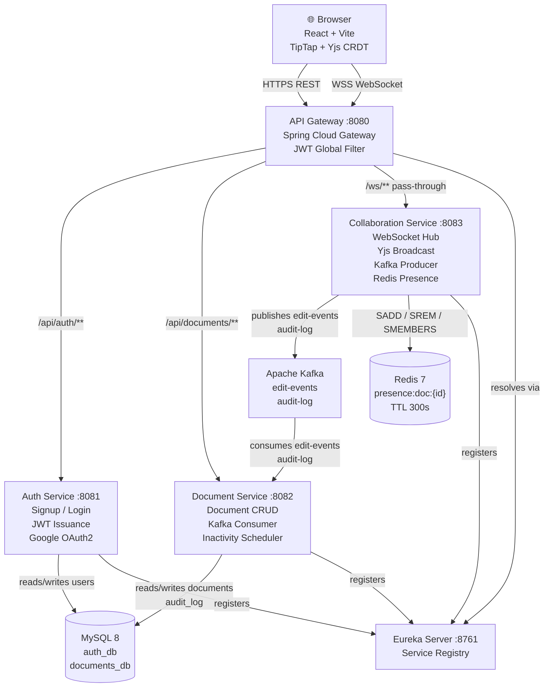
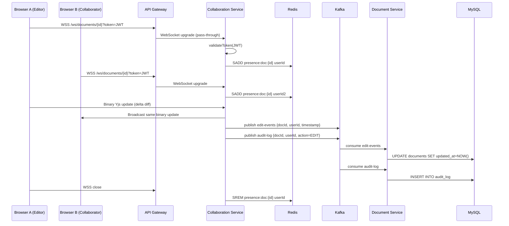
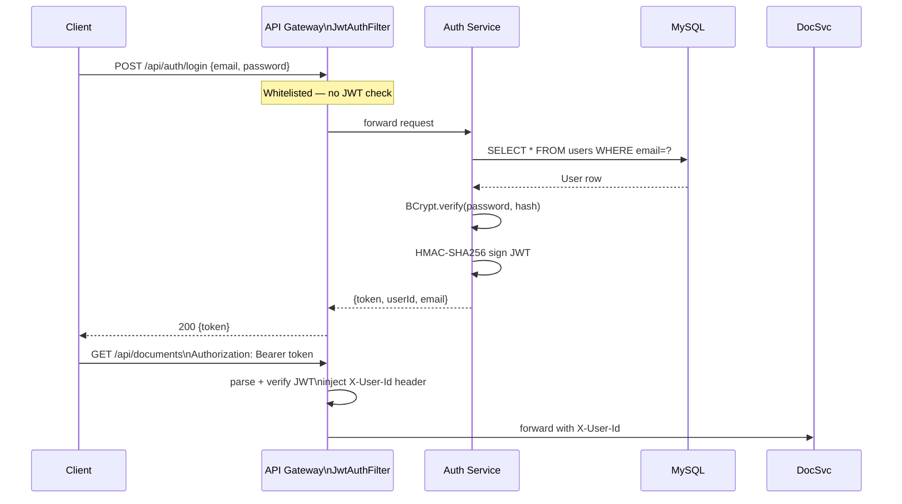
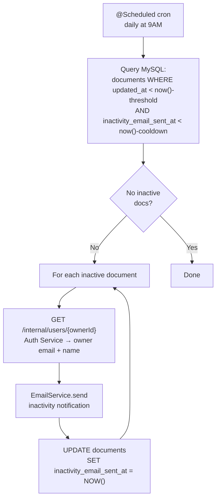
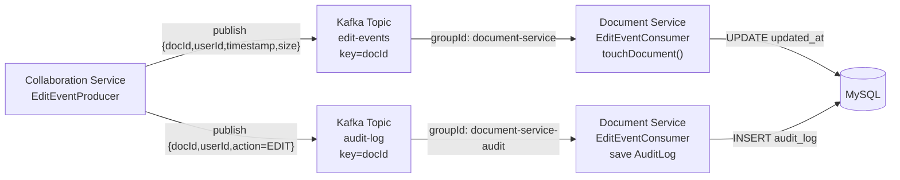
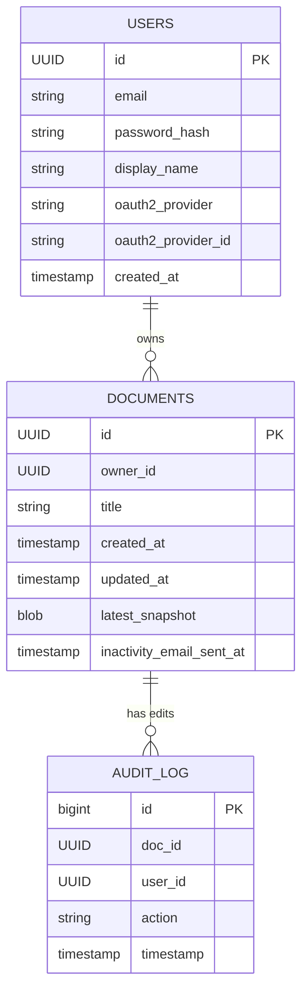

# CollabDocs — Real-Time Collaborative Document Editor

A **Google Docs-inspired** collaborative editor built from scratch to demonstrate production-grade distributed systems concepts: microservices, real-time WebSocket communication, CRDT-based conflict-free editing, Kafka event streaming, Redis presence tracking, and JWT-secured API routing.

> Built as a portfolio project to showcase system design, backend engineering, and full-stack development skills.

---

## Table of Contents

- [Features](#features)
- [System Architecture](#system-architecture)
- [Architecture Diagram](#architecture-diagram)
- [Data Flow — Edit Operation](#data-flow--edit-operation)
- [Services Deep Dive](#services-deep-dive)
- [Low Level Design (LLD)](#low-level-design-lld)
- [Tech Stack & Why Each Tool](#tech-stack--why-each-tool)
- [Project Structure](#project-structure)
- [Running Locally](#running-locally)
- [API Reference](#api-reference)
- [Interview Talking Points](#interview-talking-points)
- [Trade-offs & Future Work](#trade-offs--future-work)

---

## Features

- Real-time collaborative editing — multiple users edit the same document simultaneously
- CRDT-based conflict resolution — no merge conflicts, no locking
- JWT authentication + Google OAuth2 login
- Live presence — see who is currently editing a document
- Audit log — every edit event is persisted for accountability
- Inactivity notifications — owners are emailed when their document has been idle
- Microservice isolation — each service has its own database schema
- Full event streaming via Kafka — edit events are decoupled from persistence

---

## System Architecture

The system is split into **5 backend services** behind a single API Gateway, a React frontend, and 4 infrastructure components.

### Architecture Diagram



---

## Data Flow — Edit Operation



---

## Services Deep Dive

### 1. API Gateway (`:8080`)

**Role:** Single entry point. Routes traffic. Enforces authentication.

**Key implementation:**
- Built on **Spring Cloud Gateway** (reactive, non-blocking)
- `JwtAuthFilter` — a `GlobalFilter` at order `-1` (runs before all other filters)
  - Validates `Authorization: Bearer <token>` header on every protected route
  - On valid JWT, injects `X-User-Id` header into the forwarded request so downstream services know who the caller is — **no downstream service needs to validate JWT again**
  - Whitelists `/api/auth/login`, `/api/auth/signup`, `/oauth2/**`, and `/ws/**`
  - WebSocket connections are **passed through** — JWT is in the query param and validated by the Collaboration Service directly
- Registers with Eureka and resolves downstream service addresses via service IDs (load-balanced)

**Why Gateway?** Centralizes cross-cutting concerns (auth, CORS, rate limiting) so individual services stay focused on business logic.

---

### 2. Auth Service (`:8081`)

**Role:** User identity. Issues JWT tokens. Supports email/password and Google OAuth2.

**Key implementation:**
- `AuthService.signup()` — checks for duplicate email, hashes password with BCrypt, persists user, issues JWT
- `AuthService.login()` — fetches user by email, verifies BCrypt hash, issues JWT
- `JwtService` — signs tokens with HMAC-SHA256 using a shared secret (`jwt.secret`) configured in all services
- `OAuth2SuccessHandler` — handles the OAuth2 callback from Google, upserts user record, issues JWT and redirects to frontend
- `SecurityConfig` — disables CSRF (stateless JWT), configures public endpoints, wires OAuth2 provider
- `GlobalExceptionHandler` — maps `ConflictException` → 409, `UnauthorizedException` → 401

**Database schema (`auth_db.users`):**

```
users
├── id            UUID (PK, auto-generated)
├── email         VARCHAR, UNIQUE, NOT NULL
├── password_hash VARCHAR, NULLABLE (null for OAuth2 users)
├── display_name  VARCHAR, NOT NULL
├── oauth2_provider       VARCHAR, NULLABLE  (e.g. "google")
├── oauth2_provider_id    VARCHAR, NULLABLE
└── created_at    TIMESTAMP
```

**Why separate auth DB?** Microservice principle — no service should own another service's data. Auth owns users; Document Service refers to users only by UUID.

---

### 3. Document Service (`:8082`)

**Role:** Document CRUD, snapshot persistence, audit trail, inactivity notifications.

**Key implementation:**

- **`DocumentController`** — REST endpoints secured by `X-User-Id` header (injected by Gateway):
  - `GET /documents` — returns all documents owned by the calling user
  - `POST /documents` — creates a new document
  - `GET /documents/{id}` — returns document metadata + latest Yjs snapshot
  - `PATCH /documents/{id}` — updates title (ownership check enforced)
  - `DELETE /documents/{id}` — deletes document (ownership check enforced)
  - `PUT /documents/{id}/snapshot` — persists a binary Yjs state snapshot

- **`EditEventConsumer`** — Kafka listener:
  - `@KafkaListener(topics = "edit-events")` — calls `documentService.touchDocument()` to update `updatedAt`
  - `@KafkaListener(topics = "audit-log")` — saves `AuditLog` row to MySQL

- **`InactiveDocumentScheduler`** — `@Scheduled` cron job:
  - Runs daily at 9 AM (configurable via `app.inactivity-check-cron`)
  - Queries documents not edited since `inactivity-threshold-minutes`
  - Calls Auth Service to resolve owner's email via `AuthServiceClient`
  - Sends inactivity notification email via `EmailService`
  - Marks `inactivity_email_sent_at` to prevent re-sending within cooldown window

**Database schema:**

```
documents_db.documents
├── id               UUID (PK)
├── owner_id         UUID (logical FK to auth_db.users)
├── title            VARCHAR, NOT NULL
├── created_at       TIMESTAMP
├── updated_at       TIMESTAMP
├── latest_snapshot  LONGBLOB (binary Yjs document state)
└── inactivity_email_sent_at  TIMESTAMP, NULLABLE

documents_db.audit_log
├── id        BIGINT (PK, auto-increment)
├── doc_id    UUID
├── user_id   UUID
├── action    VARCHAR  (e.g. "EDIT")
└── timestamp TIMESTAMP
```

---

### 4. Collaboration Service (`:8083`)

**Role:** Real-time WebSocket hub. Broadcasts Yjs updates. Tracks presence. Publishes Kafka events.

**Key implementation — `CollabWebSocketHandler`:**

In-memory state (per JVM instance):
```
docSessions:    ConcurrentHashMap<docId, Set<WebSocketSession>>
sessionDocMap:  ConcurrentHashMap<sessionId, docId>
sessionUserMap: ConcurrentHashMap<sessionId, userId>
```

- **`afterConnectionEstablished`** — extracts `docId` from URL path, validates JWT from `?token=` query param, registers session in all 3 maps, calls `PresenceService.addUser()`
- **`handleBinaryMessage`** — receives Yjs binary update, copies the `ByteBuffer` payload (buffer position advances on each read), broadcasts to all other open sessions on the same `docId`, publishes metadata event to Kafka
- **`afterConnectionClosed`** — cleans up all 3 maps, calls `PresenceService.removeUser()`

**`EditEventProducer`** — publishes to two Kafka topics per edit:
- `edit-events` — `{eventId, docId, userId, timestamp, updateSize}`
- `audit-log` — `{eventId, docId, userId, action: "EDIT", timestamp}`
- Key is `docId` — guarantees ordering per document (same partition)

**`PresenceService`** — Redis-backed:
- Key pattern: `presence:doc:{docId}` → Redis Set of userIds
- TTL: 300 seconds (auto-expires stale presence if service crashes)
- Operations: `SADD` on connect, `SREM` on disconnect, `SMEMBERS` for GET presence

---

### 5. Eureka Server (`:8761`)

**Role:** Service registry and discovery.

All 4 services register themselves with Eureka on startup. The API Gateway resolves downstream addresses using Eureka service IDs (`lb://auth-service`, `lb://document-service`, `lb://collaboration-service`) rather than hardcoded hostnames — enabling load balancing and location transparency.

---

## Low Level Design (LLD)

### Authentication Flow



### Inactivity Notification Flow



### Kafka Event Lifecycle



### Database Schema



---

## Tech Stack & Why Each Tool

| Layer | Tool | Why This Tool |
|---|---|---|
| **Frontend** | React 18 + Vite | Fast HMR dev experience; component model maps cleanly to editor UI |
| **Rich Text Editor** | TipTap (ProseMirror-based) | First-class Yjs integration via `@tiptap/extension-collaboration`; extensible schema |
| **CRDT** | Yjs | Battle-tested in production (Evernote, JetBrains). YATA algorithm — every operation commutes, so order doesn't matter. Alternative (OT) requires transform functions for every pair of operations |
| **WebSocket Client** | y-websocket | Binary-efficient Yjs sync protocol; handles awareness (presence) and document sync in one connection |
| **Backend Language** | Java 17 + Spring Boot 3 | Strong typing, mature ecosystem, Spring's dependency injection reduces boilerplate |
| **API Gateway** | Spring Cloud Gateway | Reactive (non-blocking), integrates with Eureka for service discovery, supports GlobalFilter for cross-cutting auth logic |
| **Service Discovery** | Netflix Eureka | Self-registration pattern — services register on startup; gateway resolves addresses without hardcoded URLs |
| **Message Broker** | Apache Kafka | Persistent, replayable event log. Decouples "edit happened" from "edit is saved". Enables audit trail, replay, and async persistence without blocking the real-time path |
| **Cache / Presence** | Redis | O(1) set operations for presence tracking. TTL-based expiry prevents stale presence data if a service crashes |
| **Database** | MySQL 8 | ACID guarantees for document ownership and audit logs. `LONGBLOB` for binary Yjs snapshots. Two separate schemas enforce service isolation |
| **ORM** | Spring Data JPA (Hibernate) | Repository pattern removes SQL boilerplate; `@Lob` + `LONGBLOB` for binary snapshot storage |
| **Authentication** | JWT (JJWT library) | Stateless — gateway can validate without a network call to Auth Service. Shared secret distributed to services that need validation |
| **OAuth2** | Spring Security OAuth2 | Standard Google login; maps provider identity to internal User entity; issues same JWT format |
| **Password Hashing** | BCrypt | Adaptive cost factor; resistant to GPU brute-force |
| **Containerization** | Docker Compose | Reproducible local environment; all infrastructure starts with one command |
| **Build** | Maven (multi-module) | Parent POM shares dependency versions across all backend services |

---

## Project Structure

```
collab-docs/
├── docker-compose.yml           # MySQL, Redis, Kafka, Zookeeper, Kafka UI
├── 01-create-schemas.sql        # Creates auth_db and documents_db
│
├── backend/
│   ├── pom.xml                  # Parent POM — shared Spring Boot + dependency versions
│   ├── eureka-server/           # Netflix Eureka registry (:8761)
│   ├── api-gateway/
│   │   └── filter/JwtAuthFilter # GlobalFilter: validates JWT, injects X-User-Id
│   ├── auth-service/
│   │   ├── entity/User          # JPA entity — users table
│   │   ├── service/AuthService  # signup, login logic
│   │   ├── service/JwtService   # token generation + validation
│   │   ├── oauth2/              # Google OAuth2 success handler
│   │   └── controller/          # POST /signup, POST /login, GET /me
│   ├── document-service/
│   │   ├── entity/Document      # JPA entity — LONGBLOB snapshot
│   │   ├── entity/AuditLog      # JPA entity — audit_log table
│   │   ├── controller/          # Document CRUD endpoints
│   │   ├── kafka/EditEventConsumer  # Kafka listener: edit-events + audit-log
│   │   └── scheduler/           # InactiveDocumentScheduler + EmailService
│   └── collaboration-service/
│       ├── handler/CollabWebSocketHandler  # WebSocket hub, Yjs broadcast
│       ├── kafka/EditEventProducer         # Publishes to edit-events + audit-log
│       ├── presence/PresenceService        # Redis-backed presence tracking
│       └── controller/PresenceController  # GET /presence/{docId}
│
└── frontend/
    └── src/
        ├── pages/
        │   ├── Login.tsx          # Email/password login form
        │   ├── Signup.tsx         # Registration form
        │   ├── DocumentList.tsx   # Lists user's documents
        │   ├── CollabEditor.tsx   # TipTap + Yjs real-time editor
        │   └── OAuth2Callback.tsx # Handles Google OAuth2 redirect
        ├── components/
        │   └── PresenceBar.tsx    # Shows active collaborators
        └── hooks/
            └── useAuth.ts         # Auth context: user, token, login, logout
```

---

## Running Locally

### Prerequisites

- Docker + Docker Compose
- Java 17+
- Node.js 20+
- Maven 3.9+

### 1. Start infrastructure

```bash
docker compose up -d
./smoke-test-infra.sh
```

Expected: green checks for MySQL, Redis, Kafka, Zookeeper.

| Dashboard | URL |
|---|---|
| Kafka UI | http://localhost:8090 |
| Eureka | http://localhost:8761 |

### 2. Start backend services (separate terminals)

```bash
cd backend
mvn spring-boot:run -pl eureka-server    # start first
mvn spring-boot:run -pl api-gateway
mvn spring-boot:run -pl auth-service
mvn spring-boot:run -pl document-service
mvn spring-boot:run -pl collaboration-service
```

### 3. Start frontend

```bash
cd frontend
npm install
npm run dev
```

### 4. Open

| Service | URL |
|---|---|
| Frontend | http://localhost:5173 |
| API Gateway | http://localhost:8080 |

---

## API Reference

### Auth (`/api/auth`)

| Method | Endpoint | Auth | Description |
|---|---|---|---|
| POST | `/api/auth/signup` | None | Register with email + password |
| POST | `/api/auth/login` | None | Login, returns JWT |
| GET | `/api/auth/me` | Bearer JWT | Get current user profile |

### Documents (`/api/documents`)

| Method | Endpoint | Auth | Description |
|---|---|---|---|
| GET | `/api/documents` | Bearer JWT | List user's documents |
| POST | `/api/documents` | Bearer JWT | Create document |
| GET | `/api/documents/{id}` | Bearer JWT | Get document + Yjs snapshot |
| PATCH | `/api/documents/{id}` | Bearer JWT | Update title |
| DELETE | `/api/documents/{id}` | Bearer JWT | Delete document |
| PUT | `/api/documents/{id}/snapshot` | Bearer JWT | Save Yjs binary snapshot |

### WebSocket

| Endpoint | Query Params | Description |
|---|---|---|
| `ws://localhost:8080/ws/documents/{docId}` | `?token=<JWT>` | Real-time collaboration channel |

### Presence

| Method | Endpoint | Auth | Description |
|---|---|---|---|
| GET | `/api/collaboration/presence/{docId}` | Bearer JWT | Get active user IDs on a document |

---

## Interview Talking Points

**1. Why microservices for this project?**
Different scaling characteristics. WebSocket connections scale with concurrent users (Collaboration Service needs more instances with high concurrency). Document reads/writes scale with total document count (Document Service needs more DB connections). Splitting them means you can scale each independently.

**2. Why Yjs over a custom CRDT or OT?**
Production CRDTs are a research problem — Yjs represents years of academic work implementing the YATA algorithm. The interesting engineering here was integrating Yjs with Kafka for a durable event log and building the server-side broadcast infrastructure. OT (used by original Google Docs) requires a transformation function for every pair of concurrent operations — O(n²) complexity as operation types grow. Yjs is O(log n).

**3. Why Kafka instead of direct calls?**
Kafka provides: (1) **durability** — if Document Service is down, edits queue and process on restart; (2) **audit trail** — every edit is immutably logged; (3) **decoupling** — Collaboration Service doesn't need to know Document Service's persistence logic; (4) **replayability** — replay events to rebuild state or feed analytics.

**4. How does conflict resolution work?**
CRDT — specifically Yjs's YATA algorithm. Every Yjs update is a commutative operation: applying updates A then B gives the same result as B then A. The server doesn't arbitrate — it just broadcasts. Each client converges to the same state independently.

**5. Why is JWT validated in both Gateway and Collaboration Service?**
WebSocket upgrades can't carry an `Authorization` header — JWT is passed as a query parameter. The Gateway passes WebSocket connections through without JWT validation; the Collaboration Service validates on connection establishment. HTTP REST calls go through the Gateway's `JwtAuthFilter`. Deliberate split, not a gap.

**6. Biggest trade-off?**
In-memory Yjs state in Collaboration Service means one instance owns one document's live sessions. If it crashes, in-flight updates are lost. Production fix: sticky session routing by `docId` + periodic snapshot writes to MySQL (already implemented). True horizontal scaling needs a cluster-aware solution like Hocuspocus or Redis-backed doc state.

---

## Trade-offs & Future Work

| Current | Production Approach |
|---|---|
| In-memory Yjs doc per instance | Redis-backed Yjs state + sticky routing by docId |
| Single Kafka broker (replication=1) | Multi-broker cluster, replication factor 3 |
| Single MySQL instance | Read replicas + HikariCP connection pool tuning |
| Snapshot written on-demand | Periodic background flush every N edits or T seconds |
| No rate limiting | Token bucket rate limiting per user at Gateway |
| No version history UI | Yjs supports history natively; wire up version timeline |
| SMTP email | Transactional email service (SendGrid / SES) |
| Local Docker Compose | Kubernetes with HPA per service |

---

## License

MIT
